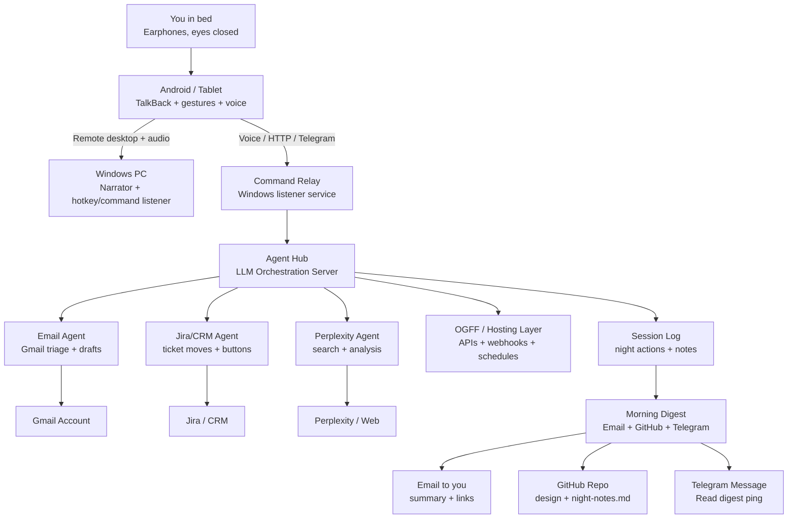

# bed-control-architecture
Night-time bed control setup: voice, gestures, headphones, Android + Windows Narrator for eyes-closed operation

## Architecture

```mermaid
flowchart TD
    YOU[You in bed<br/>Earphones, eyes closed] --> ANDROID[Android / Tablet<br/>TalkBack + gestures + voice]
    ANDROID -->|Remote desktop + audio| WINDOWS[Windows PC<br/>Narrator + hotkey/command listener]
    ANDROID -->|Voice / HTTP / Telegram| RELAY[Command Relay<br/>Windows listener service]
    RELAY --> AGENT_HUB[Agent Hub<br/>LLM Orchestration Server]
    AGENT_HUB --> EMAIL_AGENT[Email Agent<br/>Gmail triage + drafts]
    AGENT_HUB --> JIRA_AGENT[Jira/CRM Agent<br/>ticket moves + buttons]
    AGENT_HUB --> PPLX_AGENT[Perplexity Agent<br/>search + analysis]
    EMAIL_AGENT --> GMAIL[Gmail Account]
    JIRA_AGENT --> JIRA[Jira / CRM]
    PPLX_AGENT --> PPLX[Perplexity / Web]
    AGENT_HUB --> OGFF[OGFF / Hosting Layer<br/>APIs + webhooks + schedules]
    AGENT_HUB --> LOGS[Session Log<br/>night actions + notes]
    LOGS --> MORNING[Morning Digest<br/>Email + GitHub + Telegram]
    MORNING --> EMAIL_DIGEST[Email to you<br/>summary + links]
    MORNING --> GH_DIGEST[GitHub Repo<br/>design + night-notes.md]
    MORNING --> TG_DIGEST[Telegram Message<br/>Read digest ping]
```
